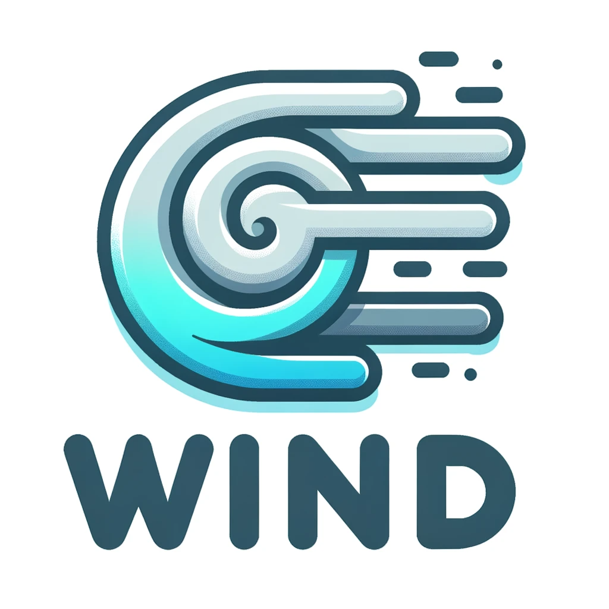

# W. I. N. D. (Waehlen, Informieren, Netzwerken, Diskutieren)

**Overview:**
W. I. N. D. is a product that emerged from the Andromeda project. It serves as a platform for voting, information, networking, and discussion on various topics.

## Authors
- [@TuragNikandam](https://www.github.com/TuragNikandam)
- [@MalteHein](https://www.github.com/MalteHein)

## Features
- Vote: Voting features for various topics.
- Inform: Latest news and updates.
- Network: Connect with other members.
- Discuss: Forum for open discussions.

## Technology Stack
**Frontend:** [Flutter](https://flutter.dev/) Cross-Platform App for iOS / Android

**Backend**: Express.js, Node.js

**Database**: MongoDB

**Other Libraries**: Mongoose, Helmet, JWT, Winston, etc.

## Demo
TBD

## Installation

### Prerequisites
- Node.js
- Flutter SDK
- MongoDB
- Mongoose

### Steps (WIP)
1. Clone the repository
```bash
git clone https://github.com/TuragNikandam/WIND
```
2. Navigate to the backend directory and run npm install
```bash
cd WIND/WebServer/AndromedaAPI/api
```
```bash
npm install
```
3. Navigate to the mobile app directory and run flutter pub get
```bash
cd WIND/Mobile/wind
```
```bash
flutter pub get
```
4. Start the MongoDB service
5. Start the backend server by running node server.js
```bash
node server.js
```
6. Launch the mobile app by running flutter run
```bash
flutter run
```

### Usage
1. Backend: The backend is built with Express.js and connects to a MongoDB database. It uses JWT for authentication and Helmet for security. It is ready to run on a server and act as a Node.js backend providing a API. 
2. Mobile App: The mobile app is built with Flutter and Dart. It uses the Provider package for state management, MVC for decoupling and much more. 

## License
This project is licensed under the MIT License - see the LICENSE file for details.

## Contact
For more information, please contact the contributors / owner.